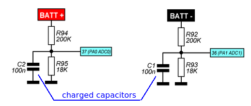
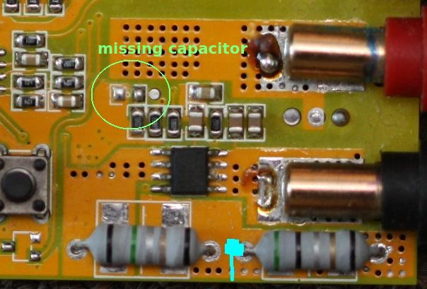
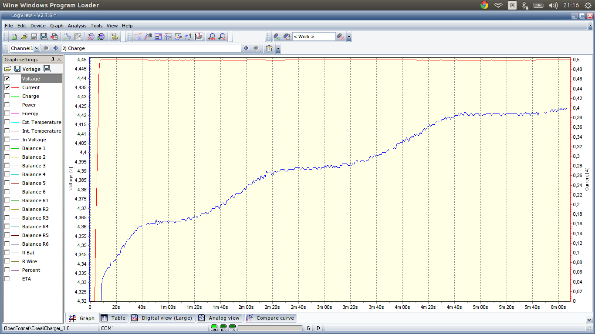
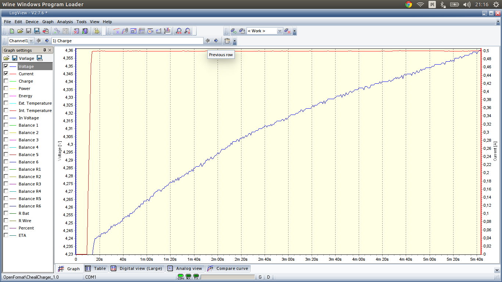

Artificial ADC noise
====================

atmel atmega32 cpu
------------------
The atmega32 ADC resolution is only 10bit and we are measuring a voltage span of 30V when measuring battery voltage,
so the voltage resolution is about: 30V/1024 = 29mV.
Cheali-charger is trying to enhance the ADC resolution by using a method called [‘Oversampling and
Decimation’](http://www.atmel.com/images/doc8003.pdf). This method requires a noisy signal at input,
although the charger itself generates some noise, the noise level might be not enough.
For this reason cheali-charger has a buildin artificial ADC noise generator,
you can enable it in [settings](settings/settings.md#nimh-nicd-specific-settings) (`adc noise: yes`).

The artificial noise is added by pseudo-randomly charging two capacitors when no measurement is performed:

Downside of this solution is that the noise is positive and it depends on the input voltage.

note: noise is only addend to the `BAT+` and `BAT-` terminals, if you are using the balance port it will not affect
battery voltage measurements (balance port voltage measurement is more accurate, we used it whenever possible).

enabling artificial noise
-------------------------
To enable the artificial noise set: `options->settings->adc noise:` to `yes`. You can check if it's working by
connecting `BAT+` and `BAT-` terminals to `GND` and going into `options->calibrate->expert DANGER!`, you should see:
- `Vplus:  0.015V`
- `Vminus: 0.015V`

If one of the voltage is 0.000V it is very likely that your charger don't have the required capacitors:

If possible, find the missing elements and put a 100nF capacitor into it, although only noise on `BAT+` is necessary.

differences between `adc noise:` *yes/no*
----------------------------------------

`adc noise` disabled, notice the 29mV "stairs":

`adc noise` enabled:

nuvoton M0517 cpu
-----------------
The measurement is sufficiently accurate, we don't need any artificial noise.

