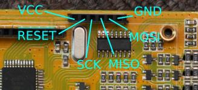
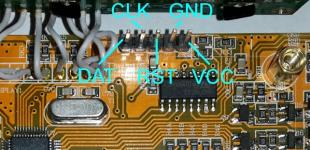

Flashing
========

Flashing: atmega32 CPU charger
-------------------------------

Flashing tutorial by PascalRZ for the [GTPower A6-10 charger](GTPowerA6-10/Tutorial GTPower A6-10.pdf).

check ISP pins (at least GND and VCC) on your chargers PCB board:
- G.T. POWER A6-10 200W:  
  
- IMAX B6 - original:  
  
- IMAX B6 - clone:  
  

select [hex file](flashing.md#differences-between-versions).

flashing using [avrdude](http://www.nongnu.org/avrdude/)
--------------------------------------------------------

The simplest way to flash a charger is to use [avrdude](http://www.nongnu.org/avrdude/) in command line:  
(you may want to change `-cusbasp` according to your programmer)
- try to make a backup:
<pre>
avrdude.exe -patmega32 -cusbasp -Uflash:r:flash.hex:r -Ulfuse:r:lfuse.hex:r -Uhfuse:r:hfuse.hex:r -Ueeprom:r:eeprom.hex:r
</pre>

- flash cheali-charger into program memory:
<pre>
avrdude.exe -patmega32 -cusbasp -Uflash:w:cheali-charger-[VERSION].hex:a
</pre>

or you can use any other avr programming tool.  
WARNING: Don't touch the AVR fuses, setting them wrong may destroy your charger.

Flashing: nuvoton M0517LBN CPU charger
--------------------------------------

check ISP pins (at least GND and VCC) on your chargers PCB board:  

- [Bu-Link](http://www.aliexpress.com/item/Free-Shipping-1SET-Bu-Link-Compatible-Nuvoton-Nu-Link-for-all-Cortex-M0-MINI51-M052-NUC120/1570055317.html):
  - Bu-Link isp connector:  
  
  - make a appropriate cable
  - use: [nuvoton icp programming tool](http://download.nuvoton.com/NuvotonMOSS/DownloadService/Member/DocumentsInfo.aspx?tp_GUID=SW0520101208200310)
   (try to make a backup first!)

- ST-LINK/V2 or STM32F4DISCOVERY board:
  - [read](https://groups.google.com/d/msg/cheali-charger/2Rz-dtwZ5Is/zUGr3PzX9bcJ)

- flashing and debugging M0517LBN with CoIDE: TODO
- flashing and debugging M0517LBN with OpenOCD: TODO

Differences between versions
----------------------------

Cheali-charger supports three different charger architectures:
- atmel: atmega32/200W chargers
- atmel: atmega32/50W chargers
- nuvoton: M0517/50W chargers

firmware within the same architecture are mostly interchangeable,  
(they differ only in the default calibration and sometimes in output power).  
WARNING: flashing a firmware with higher output power may destroy your charger.

You can find the latest unstable version [here](../hex/unstable/).

| firmware name                                                 | architecture  |  differences                          |
|---------------------------------------------------------------|---------------|---------------------------------------|
|cheali-charger-Dual-Power-B6AC-80W-RC_[version]_atmega32.hex   |atmega32/50W   | power 80W, more advanced voltage measurement on first two cells, see 1.|
|cheali-charger-GTPowerA6-10_[version]_atmega32.hex             |atmega32/200W  |                                       |
|cheali-charger-imaxB6-clone_[version]_atmega32.hex             |atmega32/50W   |                                       |
|cheali-charger-imaxB6-clone_[version]_nuvoton-M0517.hex        |M0517/50W      |                                       |
|cheali-charger-imaxB6-original_[version]_atmega32.hex          |atmega32/50W   |                                       |
|cheali-charger-Turnigy-A-6-10-200W_[version]_atmega32.hex      |atmega32/200W  |                                       |
|cheali-charger-Turnigy-Accucel-6-50W-5A_[version]_atmega32.hex |atmega32/50W   |                                       |
|cheali-charger-Turnigy-Accucel-8-150W-7A_[version]_atmega32.hex|atmega32/200W  | power 150W, 8-cells, swapped LCD pins |
|cheali-charger-Turnigy-MEGA-400Wx2_[version]_atmega32.hex      |atmega32/200W  | power 400W                            |

1. atmega32/50W and M0517/50W chargers have a simplified circuit for voltage measurement on first two cells (two op-amps are missing),
   this is the reason why there is a "expert" calibration. The B6AC-80W-RC is an exception.

