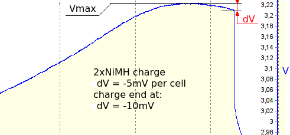

charging NiMH, NiCd
===================

Cheali-charger uses the ΔV method and the dT/dt method (if external temperature probe is enabled) 
to determine when a battery is fully charged,
in order for these methods to be effective, the charge current must be no less than 0.5C, see 
[NiMH charging](http://en.wikipedia.org/wiki/Nickel%E2%80%93metal_hydride_battery#Charging).

WARNING: make sure your battery is suitable for high current charging.

charging with small current
---------------------------

If the charging current is too small (for example 0.1C) it is very likely that cheali-charger will not
be able to determine the end of charge, in this case you should set a appropriate charging time limit (`edit battery`->`Tlim:`)
and capacity cut-off limit (see [settings](settings/settings.md#general-settings)).

ΔV method and atmega32
----------------------

In the ΔV method we are trying to measure a voltage drop of about -5mV (per cell) on output.

The atmega32 ADC resolution is only 10bit and we are measuring a voltage span of 30V,
so the voltage resolution is about: 30V/1024 = 29mV, this might be not enough for the ΔV method to work.
Cheali-charger is trying to enhance the ADC resolution by using a method called [‘Oversampling and
Decimation’](http://www.atmel.com/images/doc8003.pdf). This method requires a noisy signal at input,
although the charger itself generates some noise, the noise level might be not enough,
for this reason on atmega32 based chargers it is recommended to 
enable artificial noise in [settings](settings/settings.md#nimh-nicd-specific-settings) (`adc noise: yes`), 
see also [artificial adc noise](artificial_adc_noise.md).

