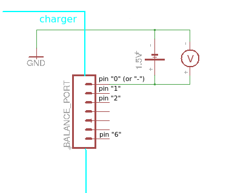

Calibration - Expert (IMAX B6 and clones only) - optional
-----------------------------------------

If you want to improve voltage measurement accuracy on the first two cells you can try  
to calibrate each pin "0-2" separately.  
BE AWARE THAT ON SOME CHARGERS THIS CAN BE DANGEROUS!!!

First check if you can safely proceed by using the following test:

- disconnect everything from the charger including power supply
- measure resistance between GND and pin "0"  
  you can use GND from ISP connector (programmer connector) or any other GND on the charger
- if the resistance is very low (less than 1k Ohm) STOP THIS PROCEDURE!

If the measured resistance is higher than 1k Ohm you can proceed as follows:

- connect power supply to the charger and go to "options"->"calibrate"->"expert DANGER!"
- calibrate pin "0" (Vb0pin):
  - connect a 1.5V battery in series with a resistor (1k Ohm to 10kOhm) between GND and pin "0"  
   
  - if the charger shows ~1.5V in "Vb0pin:" then remove the resistor and connect only the battery  
    between GND and pin "0"  
   
  - with a multimeter measure the voltage between GND and pin "0".  
    Adjust "Vb0pin" to this value using the inc/dec buttons
  - disconnect the 1.5V battery
- repeat the same steps as before for pin "1" (balance port first cell)  
  you can use a higher voltage battery ~4.20V
- repeat the same steps as before for oin "2" (balance port second cell)  
  you can use a higher voltage battery ~8.40V
- you can repeat the same steps for the batteries "-" and "+" terminals

If you do any changes in "options"->"calibrate"->"voltage" you have to repeat this process.

