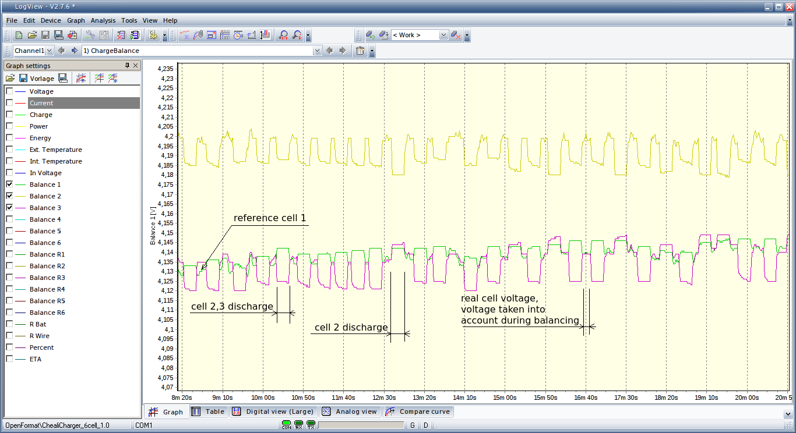

# Balancing

Cheali-charger allows you to balance some types of batteries.
Balancing is performed by _discharging_ (see 1.) some of the cells through the balance port.
At start the charger selects one _reference cell_ (marked as ) with the lowest voltage.
If a cell voltage is greater than the _reference cell_ voltage plus the _balance error_ then 
the cell (marked as ) will be gradually _discharged_ until its voltage goes below the _reference cell_ voltage.
If a cell voltage is lower than the _reference cell_ voltage plus the _balance error_, 
the cell (marked as ) won't be _discharged_.  
It should be noted that the balance port is also used to measure cell voltages. During a cell _discharge_
the voltage measurement is inaccurate, therefore cheali-charger _discharges_ the cells in short intervals, see graph. 

(1.) cells are discharged through a balancing resistor R=21 Ohm. If the _charge+balance_ program is used and the charging current
is higher than the resistor current then the cell will be in fact charged.

### charge+balance graph

## balancing screen

 - "m" - measuring cell voltages, voltage not stable yet
 - "b" - balancing in progress, real cell voltages displayed
 - "B" - balancing in progress, presumed cell voltages displayed
 -  - _reference cell_, cell with lowest voltage at start
 -  - cell left as is, no discharge performed
 - / (flashing) - _discharged_ cell (presumed cell voltages displayed)
 - 1:4.199V..3:4.144V - individual cell voltages

note: cells are _discharged_ only when battery icons are flashing.

## Tips

 - the _balance_ program should be used after a battery has been fully charged.
 - don't use the _charge+balance_ program if you cells have significant internal resistance differences, use _charge_ only.
 - if your cell voltages differ significantly use _charge_ and then _balance_ and _charge_ again.

